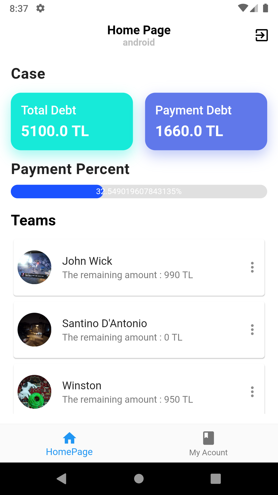
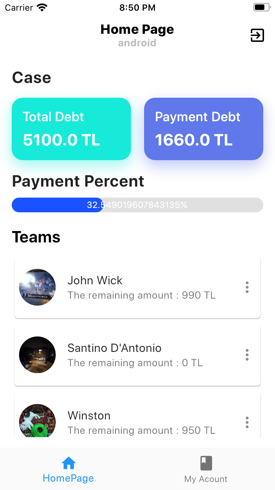

# Late Box App

This is scrum daliy late box app

- Bloc Pattern
- Firestore
- Firebase Auth
- Firebase Push Notification
- Get_It dependency injection
- Shared Preferences

<b>Google Play Link</b> 
https://play.google.com/store/apps/details?id=com.onerevolutionstudio.lateboxbook
 

<b>Android Screen</b>
 

<b>iOS Screen</b>
 

